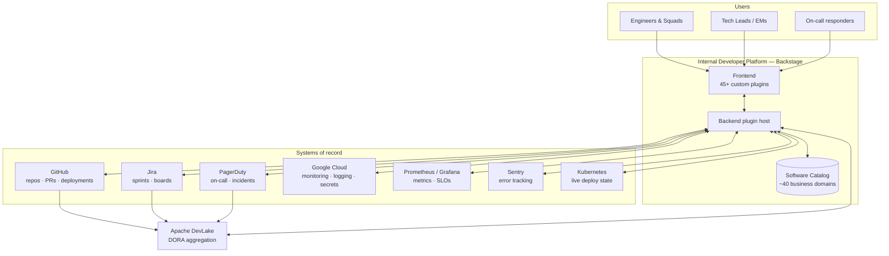

# Internal Developer Platform -> Backstage at PrestaShop

> **Case study, not source code.** This repository documents the architecture, scope and design
> decisions behind the Internal Developer Portal (IDP) I lead as Head of Platform Engineering at
> [PrestaShop](https://www.prestashop.com/) a global e-commerce SaaS platform. No proprietary
> source code, secrets, internal URLs, customer data, or colleague-identifying information is
> included. Everything here is described at the level a public engineering blog post would use.

## TL;DR

| | |
|---|---|
| **Role** | Head of Platform Engineering product owner & tech leadership for the IDP squad |
| **Foundation** | [Backstage](https://backstage.io) (CNCF), self-hosted, deployed on GKE |
| **Scale** | 45+ custom plugins · ~40 business domains modeled in the software catalog · company-wide adoption |
| **Stack** | TypeScript/React/Node monorepo, PostgreSQL, Redis, Kubernetes, Helm, ArgoCD, GitHub Actions |
| **Mandate** | One front door for every engineering team: service catalog, golden paths, observability, incident context, engineering metrics, governance |

## Architecture at a glance

The portal is a **composition layer**, not a system of record: ownership, tickets, incidents and
deploy history stay in their source tool, and the portal's job is to surface the right slice of
each next to the service it belongs to — with the right permissions. Full breakdown, including
deployment topology and the catalog data model, in [docs/ARCHITECTURE.md](docs/ARCHITECTURE.md).

**Deployed on GKE**, horizontally autoscaled, delivered via **Helm + ArgoCD** with a
promotion-based release model (build once, promote the same artifact through environments). A
single `app-config.yaml` is the source of truth, synced into the Helm values that render the
Kubernetes ConfigMap — checked by a pre-commit hook and re-verified in CI, so the config in the
PR is provably the config running in the cluster.

## Why this exists

PrestaShop runs dozens of independently-owned services across squads, tribes and business
domains (payments, marketplace, checkout, SSO, compliance, and more). Before this platform,
ownership, on-call routing, deployment history, SLOs and engineering health lived in a dozen
disconnected tools — tribal knowledge, not infrastructure.

As Head of Platform, I set the mandate, sequenced the roadmap, made the build-vs-buy and
architecture calls, and grew a small platform squad that turned Backstage from an empty
scaffold into the company's default entry point for "who owns this, is it healthy, and how do I
ship a new service correctly."

This is not a demo. It is the production developer portal for the whole engineering
organization, carrying real on-call, real deploy history, and real SLOs.

## What I actually own as Head of Platform

- **Product direction**: roadmap, prioritization against squad pain points, build-vs-adopt calls
  (e.g. Backstage over a homegrown portal, Apache DevLake over a bespoke metrics pipeline).
- **Architecture governance**: the plugin boundary model, the config-as-code discipline, the
  golden-path/scorecard standard every new service is measured against.
- **Incident & capacity calls**: diagnosing and resolving a production connection-pool exhaustion
  incident under autoscaling load (see [Engineering Decisions](docs/ENGINEERING_DECISIONS.md)) —
  reliability calls for the portal itself are the platform team's, so I own that standard rather
  than delegate it.
- **Team growth**: hiring, mentoring and code-review standards for the platform squad; the
  plugin catalog below is the output of that team, not a solo project.

## Explore the case study

- **[Architecture](docs/ARCHITECTURE.md)** — system context, deployment topology, data model,
  and the third-party ecosystem the portal integrates with.
- **[Plugin catalog](docs/PLUGINS.md)** — the 45+ custom Backstage plugins built in-house,
  grouped by domain, described in terms of *purpose and design*, not implementation.
- **[Engineering decisions](docs/ENGINEERING_DECISIONS.md)** — a redacted decision log: the
  trade-offs, the incident that forced a re-architecture, and the calls I'd make differently
  today.

## Highlights (for the skim-readers)

- **Golden paths with teeth**: a scorecard system scores every catalog entity (Bronze → Platinum)
  against governance, documentation and observability checks — not a static badge, a computed,
  queryable signal that feeds squad-level conversations.
- **Incident context in one click**: any service page surfaces an active PagerDuty incident
  banner with a time-aligned Grafana deep link and the runbook — built after seeing engineers
  lose minutes stitching that context together by hand during live incidents.
- **DORA metrics without a bespoke pipeline**: Apache DevLake aggregates GitHub + Jira +
  PagerDuty into deployment frequency, lead time and sprint-health signals surfaced natively in
  the portal, next to the service that owns them.
- **Config-as-code with a safety net**: a single `app-config.yaml` is the source of truth,
  synced into Kubernetes Helm values through a pre-commit hook *and* re-checked in CI, so the
  running cluster can never silently drift from the committed config.
- **A real production incident, resolved and documented**: an HPA scale-out event exhausted the
  database connection pool because every plugin holds its own pool — diagnosed, mitigated, and
  turned into a standing platform constraint (see the decision log).

## Stack at a glance

TypeScript · React · Node.js · Backstage (frontend + backend plugin system) · PostgreSQL (per-
plugin databases) · MySQL (read-only analytics store) · Redis · Kubernetes (GKE) · Helm ·
ArgoCD · GitHub Actions · Prometheus · Grafana · SonarQube · Jest · Playwright · Apache DevLake.

---

*This repository is intentionally a description, not a mirror, of the production system. If
you're hiring for a platform/DevEx leadership role and want to go deeper on any decision above,
[let's talk](https://github.com/WomaninTech-spec).*
