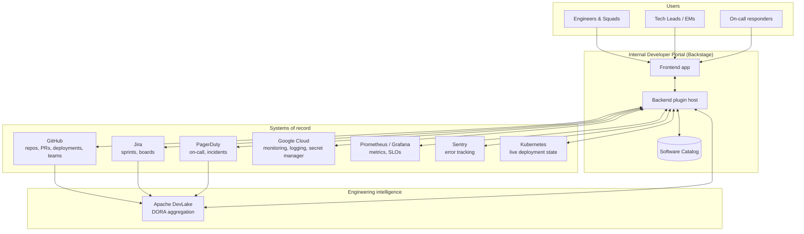

# Architecture

> High-level system context and deployment topology. Deliberately at C4 "Context/Container"
> level of detail — enough to understand how the pieces fit and why, without exposing internal
> hostnames, credentials, or infrastructure that would be exploitable outside the company.

## System context

The portal sits at the center of the engineering organization's toolchain. It doesn't own most
of the underlying data — it federates it: every card, tab and metric on a service page is read
(and sometimes written) through an integration, not duplicated by hand.

**Design principle**: the portal is a *composition layer*, not a system of record. Ownership,
ticket state, incident state and deploy history all stay in their source tool; the portal's job
is to make the right slice of each visible next to the service it belongs to, with the right
permissions.

## Deployment topology

- **Runtime**: containerized Backstage app (frontend + backend in one image) on **GKE**,
  horizontally autoscaled (2–4 replicas, CPU-based HPA).
- **Delivery**: Helm charts, promoted through environments via **ArgoCD**; releases follow a
  promotion-based model (build once, promote the same artifact forward) rather than
  rebuild-per-environment.
- **Data layer**:
  - PostgreSQL — the catalog and most plugins each own an isolated schema/pool, so plugin
    failures and load stay contained to that plugin.
  - MySQL (read-only) — feeds the engineering-intelligence plugins from the DevLake warehouse.
  - Redis — session storage and response caching (e.g. SLO report caching), managed by the
    framework rather than hand-rolled per plugin.
- **Preview environments**: every pull request gets an ephemeral, fully deployed preview stack
  in CI, so reviewers validate against a running instance instead of a diff.
- **Config as code**: a single `app-config.yaml` at the repo root is the source of truth for
  runtime configuration. A pre-commit hook mirrors it into the Helm values used to render the
  Kubernetes ConfigMap, and CI re-verifies that sync on every pull request — the goal is that the
  file you read in the PR is provably the file running in the cluster, not "probably."

## Software catalog model

The catalog models the company's engineering surface with Backstage's native entity kinds
(`Component`, `System`, `API`, `Resource`), extended with a handful of custom entity kinds and
annotations layered on top for platform-specific needs:

- **Business `System`s** — roughly 40 modeled business domains (payments, marketplace, checkout,
  identity, compliance, and others), each carrying an owning squad and lightweight
  people-metadata (tech lead / PM) so "who do I talk to" is always one click away.
- **A custom `OnCall` entity kind** — models on-call scopes and services independently from
  deployable components, wired to PagerDuty and to environment-specific log filters so an
  on-call engineer lands on the right logs for the right environment without hunting for project
  IDs.
- **External systems** — third-party dependencies (payment providers, search, CRM, webhooks) are
  first-class catalog citizens too, so "what do we depend on externally" is queryable the same
  way as internal ownership.
- **Governance annotations** — SLO definitions, scorecard checks and monitoring bindings all live
  as catalog annotations on the entity they describe, so governance data travels with the service
  instead of living in a side spreadsheet.

## Why Backstage (and what it cost)

Backstage was chosen in 2024 as the foundation over building a bespoke portal, on the strength of
its plugin architecture and the catalog data model. That bet mostly paid off, with real costs
documented candidly in [Engineering Decisions](ENGINEERING_DECISIONS.md) — most notably a UI
layer that lagged the design system we wanted, and a database-connection-pooling model
(one pool per plugin) that bit us once under autoscaling and now shapes how we size every new
plugin.
